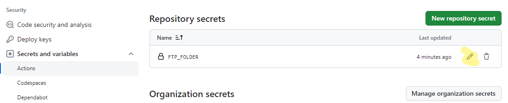

# Начало работы

Для старта достаточно при создании репозитория выбрать один из наших шаблонов `cedro-gulp-template` или `cedro-react-template`

Для старта проекта выполняем
`npm i && npm start`

## Настройка репозитория
В настройках репозитория задаём `FTP_FOLDER` секрет, для автоматической заливки на FTP (предварительно папку надо вручную создать на FTP)

