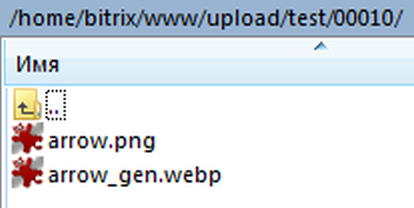
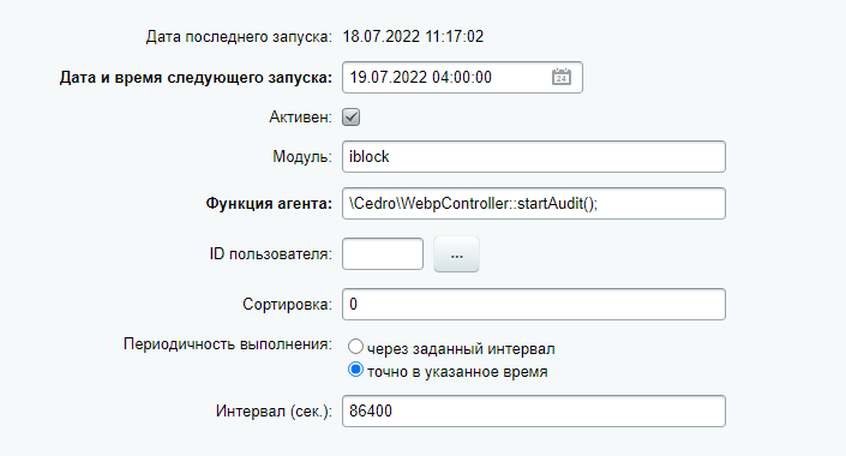

# Обработчик событий для создания .webp изображений инфоблока "на лету"

Состоит из двух классов (IBlockEventsHandler и WebpController). Создает webp версии изображений для полей инфоблока "Картинка для анонса" и "Детальная картинка" в тех же каталогах, где располагается оригинал. К имени исходного изображения добавляется суффикс указанный в свойстве WebpController::generatedWebpIdentifier. В классе имеется функция для подключения агента для фоновой обработки каталогов.



## Возможности

Реализовано через обработку событий инфоблока, webp версия изображения создается при добавлении нового элемента в инфоблок, при загрузке изображения в пустое поле существующего элемента инфоблока, при замене существующего изображения на новое. При удалении элемента инфоблока или изображения.

При подключении агента через метод WebpController::startAudit() производится обход каталогов (указанных в теле метода) и создаются webp версии для всех изображений поддерживаемых форматов (*.avif, *.bmp, *.gif, *.jpeg, *.jpg, *.png). Таким образом, покрываются изображения, загруженные при помощи свойств (в т.ч. комплексных) инфоблока типа "Файл" и изображения полученные при помощи метода CFile::ResizeImageGet(). При обходе каталога удаляются webp файлы с суффиксом WebpController::generatedWebpIdentifier, если нет оригинальных изображений, из которых они получены.

## Подключение

### Исходники

https://github.com/CedroAgency/backend_bx_starter_pack

### init.php

в /local/php_interface/init.php региструем класс и подключаем файл обработчика событий:
```php
<?
// Если используется Composer:
if (file_exists("$_SERVER[DOCUMENT_ROOT]/local/vendor/autoload.php")) {
    require_once("$_SERVER[DOCUMENT_ROOT]/local/vendor/autoload.php");
}
// Если используется API Bitrix:
Bitrix\Main\Loader::registerAutoLoadClasses(
	null, ['Cedro\Image\WebpController' => '/local/lib/Classes/Cedro/Image/WebpController.php']
);
if (file_exists("$_SERVER[DOCUMENT_ROOT]/local/lib/events.php")) {
	require_once ("$_SERVER[DOCUMENT_ROOT]/local/lib/events.php");
}
```
Соответственно, файл обработчика должен располагаться в /local/lib/events.php
а файл с классом в /local/lib/Classes/Cedro/Image/WebpController.php

### Агент

Лучше всего выбирать время, когда на сервер приходится наименьшая нагрузка (низкая посещаемость сайта). Также желательно перевести агент на Cron.
Метод \Cedro\WebpController::startAudit() можно вызвать с тестовой страницы для однократной обработки необходимых каталогов.



## Пример использования

В метод WebpController::getWebpSrc($originalPicturePath) передается путь к оригинальному изображению,
метод вовзращает путь к webp варианту, если он существует, если нет, то возвращает false.

```php
<?
use Cedro\Image\WebpController;
?>
">
```

## Код обработчика

```php
<?

use Bitrix\Main\Loader;
use Cedro\Image\WebpController;

AddEventHandler('iblock', 'OnAfterIBlockElementAdd', ['IBlockEventsHandler', 'onIBlockElementAdd']);
AddEventHandler('iblock', 'OnBeforeIBlockElementDelete', ['IBlockEventsHandler', 'onIBlockElementDelete']);
AddEventHandler('iblock', 'OnBeforeIBlockElementUpdate', ['IBlockEventsHandler', 'onBeforeIBlockElementUpdate']);
AddEventHandler('iblock', 'OnAfterIBlockElementUpdate', ['IBlockEventsHandler', 'onAfterIBlockElementUpdate']);
AddEventHandler('iblock', 'OnAfterIBlockSectionUpdate', ['IBlockEventsHandler', 'onAfterIBlockSectionUpdate']);

class IBlockEventsHandler {
	
	public static function onIBlockElementAdd(&$arFields) {
		WebpController::createWebpByPictureID($arFields['PREVIEW_PICTURE_ID']);
		WebpController::createWebpByPictureID($arFields['DETAIL_PICTURE_ID']);
	}
   
	public static function onIBlockElementDelete($iblockElementID) {
        Loader::includeModule('iblock');
        $CIBlockRes = CIBlockElement::GetByID($iblockElementID);
        if ($arFields = $CIBlockRes->GetNext()) {
            $detailPictureID = $arFields['DETAIL_PICTURE'];
            $previewPictureID = $arFields['PREVIEW_PICTURE'];
        }
        if ($detailPictureID) WebpController::deleteWebpByID($detailPictureID);
        if ($previewPictureID) WebpController::deleteWebpByID($previewPictureID);
	}
	
	public static function onBeforeIBlockElementUpdate(&$arFields) {
		$arDetailPicture = $arFields['DETAIL_PICTURE'];
		$arPreviewPicture = $arFields['PREVIEW_PICTURE'];
		if ($arDetailPicture) {
			if ($arDetailPicture['del'] == 'Y' || ($arDetailPicture["old_file"] && $arDetailPicture["size"])) {
				WebpController::deleteWebpByID($arDetailPicture["old_file"]);
			}
		}
		if ($arPreviewPicture) {
			if ($arPreviewPicture['del'] == 'Y' || ($arPreviewPicture["old_file"] && $arPreviewPicture["size"])) {
				WebpController::deleteWebpByID($arPreviewPicture["old_file"]);
			}
		}
	}
	
	public static function onAfterIBlockElementUpdate(&$arFields) {
        
    # Обновление значения блокировки в соответствующем HL блоке
        $arLockPropInfo = getIBlockElementPropertyInfo($arFields['ID'], CATALOG_IBLOCK_ID, 'LOCK_FROM_IMPORT');
        if ($arLockPropInfo) {
            $lockNewValue = ($arLockPropInfo['VALUE_XML_ID'] === 'Y') ? '1' : '0';
            $entityDC = getHighloadEntityDataClass(CATALOG_ELEMENTS_IMPORT_INFO_HL_ID);
            $arElementInfo = $entityDC::getList([
                'filter' => ['UF_IBLOCK_ELEMENT_ID' => $arFields['ID']],
                'select' => ['ID', 'UF_LOCK_FROM_IMPORT']
            ])->Fetch();
            if (is_array($arElementInfo) && ($arElementInfo['UF_LOCK_FROM_IMPORT'] != $lockNewValue)) {
                $arNewData = ['UF_LOCK_FROM_IMPORT' => $lockNewValue];
                $entityDC::update($arElementInfo['ID'], $arNewData);
            }
        }
        unset(
            $arLockPropInfo,
            $lockNewValue,
            $entityDC,
            $arElementInfo,
            $arNewData
        );
    # /Обновление значения блокировки в HL блоке
        
    # WebpController
		if ($arFields['DETAIL_PICTURE_ID']) WebpController::createWebpByPictureID($arFields['DETAIL_PICTURE_ID']);
		if ($arFields['PREVIEW_PICTURE_ID']) WebpController::createWebpByPictureID($arFields['PREVIEW_PICTURE_ID']);
    # /WebpController
	}
    
    // Переключает в HLB активность раздела при её изменении в админке инфоблока
    public static function onAfterIBlockSectionUpdate($arFields) {
        if ($arFields['IBLOCK_ID'] == CATALOG_IBLOCK_ID) {
            $entityDataClass = getHighloadEntityDataClass(IMPORT_SETTINGS_HL_ID);
            $queryResData = $entityDataClass::getList([
                'filter' => ['UF_SECTION' => $arFields['ID']],
                'select' => ['ID', 'UF_IS_SECTION_ACTIVE']
            ])->Fetch();
            if ($queryResData) {
                if ($arFields['ACTIVE'] === 'Y') {
                    $binActivityInIBlock = '1';
                }
                elseif ($arFields['ACTIVE'] === 'N') {
                    $binActivityInIBlock = '0';
                }
                
                if ($queryResData['UF_IS_SECTION_ACTIVE'] !== $binActivityInIBlock) {
                    $hlRecordID = (int)$queryResData['ID'];
                    $arBindData = [
                        'UF_IS_SECTION_ACTIVE' => $binActivityInIBlock,
                        'UF_LAST_TIME_MODIFIED' => time()
                    ];
                    $resObj = $entityDataClass::update($hlRecordID, $arBindData);
                    $updRes = $resObj->isSuccess();
                    if (!$updRes) {
                        CEventLog::Add([
                            'SEVERITY' => 'ERROR',
                            'AUDIT_TYPE_ID' => 'Ошибка переключения активности раздела',
                            'MODULE_ID' => 'highloadblock',
                            'ITEM_ID' => "IBlock ID: $arFields[IBLOCK_ID], HLB Record ID: $queryResData[ID]",
                            'DESCRIPTION' => 'Ошибка переключения активности раздела каталога в Highload блоке'
                        ]);
                    }
                }
            } 
        }
    }
}
```

## Код класса

```php
<?namespace Cedro\Image;

use CFile;

class WebpController {
	
	// Две записи в каталоге: ссылки на текущий каталог (.) и родительский (..)
	private const EMPTY_DIR = 2;
	
	// Три записи в каталоге: помимо вышеуказанных, добавился файл
	private const ONE_ELEMENT_IN_DIR = 3;
	
	private static $uploadDirPath = '/upload';
	
	private static $iblockUploadDirPath = '/upload/iblock';
	
	private static $iblockResizeUploadDirPath = '/upload/resize_cache/iblock';
	
	private static $iblockVoteUploadDirPath = '/upload/vote';
	
	// Уровень качества указывается в виде числа от 0 (наихудшее) до 100 (наилучшее)
	private static $outputQuality = 85;
	
	/* Суффикс и расширение сжатого в webp файла, используется в качестве идентификатора
		сгенерированного данным скриптом webp файла */
	public static $generatedWebpIdentifier = '_cedg.webp';
	
	// Поддерживаемые форматы изображений для конвертации в webp 
	private static $compatibleMIMEtypes = [
		'avif' => 'image/avif',
		'bmp' => 'image/bmp',
		'gif' => 'image/gif',
		'jpeg' => 'image/jpeg',
		'jpg' => 'image/jpg',
		'png' => 'image/png'
	];
	
	public static function createWebpByPictureID($id) {
		$path = CFile::GetPath($id);
		$arPicturePathInfo = self::getPicturePathArray($path);
		if ($arPicturePathInfo && $arPicturePathInfo['compatible']) self::createWebp($arPicturePathInfo);
	}
	
	// Конвертация в webp при помощи библиотеки GD
	private static function createWebp($arPicturePathInfo) {
		if ($arPicturePathInfo['extension'] == 'jpg') $arPicturePathInfo['extension'] = 'jpeg';
		$GDCreateFunctionName = "imagecreatefrom$arPicturePathInfo[extension]";
		$GDimage = call_user_func($GDCreateFunctionName, $arPicturePathInfo['path']);
		if (imagepalettetotruecolor($GDimage)) {
		    if ($arPicturePathInfo['extension'] == 'png' || $arPicturePathInfo['extension'] == 'avif') {
			imagealphablending($GDimage, false);
			imagesavealpha($GDimage, true);
		    }
		    imagewebp($GDimage, $arPicturePathInfo['webp_full_path'], self::$outputQuality);
		}
		imagedestroy($GDimage);
	}
	
	public static function deleteWebpByID($id) {
		$arFileInfo = CFile::GetFileArray($id);
		$queryRes = CFile::GetList(
			[], 
			[
				'CONTENT_TYPE' => $arFileInfo['CONTENT_TYPE'],
				'MODULE_ID' => $arFileInfo['MODULE_ID'],
				'SUBDIR' => $arFileInfo['SUBDIR']
			]
		);
		/* 	
		    Проверка на то, что в таблице b_file данный графический файл имеет единственный ID,
				т.е не используется в других элементах инфоблока 
		*/
		if ($queryRes->AffectedRowsCount() === 1) {
			$arPictureInfo = self::getPicturePathArray($arFileInfo['SRC']);
			$webpPath = $arPictureInfo['webp_full_path'];
			if (file_exists($webpPath)) unlink($webpPath);
		}
	}
	
	// Возвращает вспомогательный массив с информацией о файле, если он существует
	private static function getPicturePathArray($path, $isFullPath = false) {
		$fullPath = $isFullPath ? $path : $_SERVER['DOCUMENT_ROOT'] . $path;
		$arPicturePathInfo = [];
		if (file_exists($fullPath) && filesize($fullPath)) {
			$arPicturePathInfo = pathinfo($fullPath);
			$arPicturePathInfo['path'] = $fullPath;
			if (array_key_exists($arPicturePathInfo['extension'], self::$compatibleMIMEtypes)) {
				$arPicturePathInfo['webp_full_path'] = $arPicturePathInfo['dirname'] . '/' . $arPicturePathInfo['filename'] . self::$generatedWebpIdentifier;
				$arPicturePathInfo['webp_short_path'] = str_replace($_SERVER['DOCUMENT_ROOT'], '', $arPicturePathInfo['webp_full_path']);
				$arPicturePathInfo['compatible'] = true;
			}
			else $arPicturePathInfo['compatible'] = false;
		}
		else return [];
		return $arPicturePathInfo;
	}
	
	// Функция для получения адреса webp версии изображения, например, в шаблоне компонента
	public static function getWebpSrc($originalPicturePath) {
		$arOriginalPictureInfo = self::getPicturePathArray($originalPicturePath);
		if (file_exists($arOriginalPictureInfo['webp_full_path']) && filesize($arOriginalPictureInfo['webp_full_path'])) {
			return $arOriginalPictureInfo['webp_short_path'];
		} 
		else return false;
	}
	
	// Функция для запуска агента
	public static function startAudit() {
		self::bypassDirAndAuditWebp($_SERVER['DOCUMENT_ROOT'] . self::$uploadDirPath);
		return '\Cedro\Image\WebpController::startAudit();';
	}
	
	// Рекурсивная функция для обхода переданного в параметр каталога
	private static function bypassDirAndAuditWebp($dir) {
		$dirContent = scandir($dir);
		foreach ($dirContent as $dirItem) {
			if ($dirItem == '.' || $dirItem == '..') continue;
			$currentPath = "{$dir}/{$dirItem}";
			if (is_dir($currentPath)) {
				if (count(scandir($currentPath)) === self::EMPTY_DIR) rmdir($currentPath);
				else self::bypassDirAndAuditWebp($currentPath);
			}
			elseif (is_file($currentPath)) {
				$arFilePathInfo = self::getPicturePathArray($currentPath, true);
				if (array_key_exists($arFilePathInfo['extension'], self::$compatibleMIMEtypes)) {
					if (!file_exists($arFilePathInfo['webp_full_path']) || !filesize($arFilePathInfo['webp_full_path'])) {
						self::createWebp($arFilePathInfo);
					} 
				}
				elseif (substr($currentPath, -strlen(self::$generatedWebpIdentifier)) == self::$generatedWebpIdentifier) {
					if (count($dirContent) === self::ONE_ELEMENT_IN_DIR) {
						unlink($currentPath);
						rmdir($dir);
					}
					elseif (!filesize($currentPath)) {
						unlink($currentPath);
					}
					else {
						$probableOriginalImagePathPart = strstr($currentPath, self::$generatedWebpIdentifier, true);
						foreach (self::$compatibleMIMEtypes as $compatibleExtension => $mimeType) {
							if (file_exists($probableOriginalImagePathPart . ".$compatibleExtension")) {
								$hasOriginalInDir = true;
								break;
							}
							$hasOriginalInDir = false;
						}
						if (!$hasOriginalInDir) unlink($currentPath);
					}
				}
			}
		}
	}
}
```
