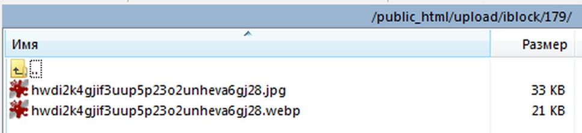

# Обработчик событий для создания .webp изображений инфоблока "на лету"

Состоит из двух классов (IBlockEventsHandler и webpController). Создает webp версии изображений для полей инфоблока "Картинка для анонса" и "Детальная картинка" в тех же каталогах, где располагается оригинал.


## Возможности

Реализовано через обработку событий инфоблока, webp версия изображения создается при добавлении нового элемента в инфоблок, при загрузке изображения в пустое поле существующего элемента инфоблока, при замене существующего изображения на новое. При удалении элемента инфоблока или изображения.

### Ограничение (требует доработки)

В текущей реализации, если один физический графический файл имеет несколько ID в таблице b_file (загружен дубликат, который используется в другом элементе инфоблока), то при изменении/удалении изображения элемента инфоблока или при удалении всего элемента инфоблока, webp версия изображения удаляется из каталога, а оригинал остается, т.к он используется в другом элементе. Таким образом, дубликаты остаются без webp версии.

## Подключение

Подключается стандартно, в /local/php_interface/init.php подключаем файл
```php
<?require_once ('include/event_handlers.php');
```
Соответственно файл должен располагаться в /local/php_interface/include/event_handlers.php

## Код обработчика

```php
<?
// Регистрируем обработчики событий, все они колбэки являются методами класса IBlockEventsHandler
AddEventHandler('iblock', 'OnAfterIBlockElementAdd', ['IBlockEventsHandler', 'onIBlockElementAdd']);
AddEventHandler('iblock', 'OnBeforeIBlockElementDelete', ['IBlockEventsHandler', 'onIBlockElementDelete']);
AddEventHandler('iblock', 'OnBeforeIBlockElementUpdate', ['IBlockEventsHandler', 'onBeforeIBlockElementUpdate']);
AddEventHandler('iblock', 'OnAfterIBlockElementUpdate', ['IBlockEventsHandler', 'onAfterIBlockElementUpdate']);

class IBlockEventsHandler {
	
    /* При создании нового элемента инфоблока проверяется наличие изображений (картинки для анонса и детальной
        картинки), при их наличии проверяется соответствие MIME-типам (возможность конвертации в webp */
	function onIBlockElementAdd(&$arFields) {
		webpController::checkAndProcess($arFields["PREVIEW_PICTURE_ID"], $arFields["PREVIEW_PICTURE"]["type"]);
		webpController::checkAndProcess($arFields["DETAIL_PICTURE_ID"], $arFields["DETAIL_PICTURE"]["type"]);
	}
	
    // Обработка при удалении элемента инфоблока
	function onIBlockElementDelete($iblockElementID) {
		if (CModule::IncludeModule('iblock')) {
			$CIBlockRes = CIBlockElement::GetByID($iblockElementID);
			if ($arFields = $CIBlockRes->GetNext()) {
				$detailPictureID = $arFields['DETAIL_PICTURE'];
				$previewPictureID = $arFields['PREVIEW_PICTURE'];
			}
			
			if ($detailPictureID) webpController::deleteWEBP( webpController::getPictureInfoById($detailPictureID) );
			if ($previewPictureID) webpController::deleteWEBP( webpController::getPictureInfoById($previewPictureID) );
		}
	}
	
    /* Перед изменением элемента инфоблока: если изображение удаляется из поля или меняется на новое, то вызывается
        метод webpController::deleteWEBP() для удаления webp версии */
	function onBeforeIBlockElementUpdate(&$arFields) {
		$arDetailPicture = $arFields['DETAIL_PICTURE'];
		$arPreviewPicture = $arFields['PREVIEW_PICTURE'];
		if ($arDetailPicture) {
			if ($arDetailPicture['del'] == 'Y' || ($arDetailPicture["old_file"] && $arDetailPicture["size"])) {
				webpController::deleteWEBP( webpController::getPictureInfoById($arDetailPicture["old_file"]) );
			}
		}
		if ($arPreviewPicture) {
			if ($arPreviewPicture['del'] == 'Y' || ($arPreviewPicture["old_file"] && $arPreviewPicture["size"])) {
				webpController::deleteWEBP( webpController::getPictureInfoById($arPreviewPicture["old_file"]) );
			}
		}
	}
	
    /* После изменения элемента инфоблока: если загружено новое изображение в поле, то вызывается метод
        webpController::createWEBP() для создания webp версии изображения */
	function onAfterIBlockElementUpdate(&$arFields) {
		if ($arFields['DETAIL_PICTURE_ID']) {
			$arDetailPictureInfo = webpController::getPictureInfoById($arFields['DETAIL_PICTURE_ID']);
			if (array_key_exists($arDetailPictureInfo['EXTENSION'], webpController::$compatibleMIMEtypes)) {
				webpController::createWEBP($arDetailPictureInfo);
			}
		}
		if ($arFields['PREVIEW_PICTURE_ID']) {
			$arPreviewPictureInfo = webpController::getPictureInfoById($arFields['PREVIEW_PICTURE_ID']);
			
			if (array_key_exists($arPreviewPictureInfo['EXTENSION'], webpController::$compatibleMIMEtypes)) {
				webpController::createWEBP($arPreviewPictureInfo);
			}
		}
	}
}

class webpController {
		
	private static $outputQuality = 85;
	
	public static $compatibleMIMEtypes = [
		'avif' => 'image/avif',
		'bmp' => 'image/bmp',
		'gif' => 'image/gif',
		'jpeg' => 'image/jpeg',
		'jpg' => 'image/jpg',
		'png' => 'image/png'
	];
	
    // Проверка наличия существования ID и соответствия MIME-типу
	public static function checkAndProcess($pictureID, $pictureMimeType) {
		if ($pictureID && in_array($pictureMimeType, self::$compatibleMIMEtypes)) {
			self::createWEBP(self::getPictureInfoById($pictureID));
		}
	}
	
    // Конвертация в webp при помощи библиотеки GD
	public static function createWEBP($pictureFileInfo) {
		$GDCreateFunctionName = "imagecreatefrom$pictureFileInfo[EXTENSION]";
		$GDimage = call_user_func($GDCreateFunctionName, $pictureFileInfo['FULL_PATH']);
		imagewebp($GDimage, $pictureFileInfo['PROBABLE_WEBP_PATH'], self::$outputQuality);
		imagedestroy($GDimage);
	}
	
	public static function deleteWEBP($pictureFileInfo) {
		if (file_exists($pictureFileInfo['PROBABLE_WEBP_PATH'])) {
			$webpFilePath = $pictureFileInfo['PROBABLE_WEBP_PATH'];
			unlink($webpFilePath);
		}
	}
	
    // Формирование массива для удобной обработки
    // Планируется рефакторинг на штатную pathinfo()
	public static function getPictureInfoById($pictureID) {
		$picturePath = CFile::GetPath($pictureID);
		$arRes['FULL_PATH'] = $_SERVER['DOCUMENT_ROOT'] . $picturePath;
		$arRes['DIR'] = dirname($arRes['FULL_PATH']);
		$arRes['EXTENSION'] = Bitrix\Main\IO\Path::getExtension($picturePath);
		$arRes['FILE_NAME'] = basename($picturePath, ".$arRes[EXTENSION]");
		if ($arRes['EXTENSION'] == 'jpg') $arRes['EXTENSION'] = 'jpeg';
		$arRes['PROBABLE_WEBP_PATH'] = "{$arRes['DIR']}/{$arRes['FILE_NAME']}.webp";
		
		return $arRes;
	}
}
```