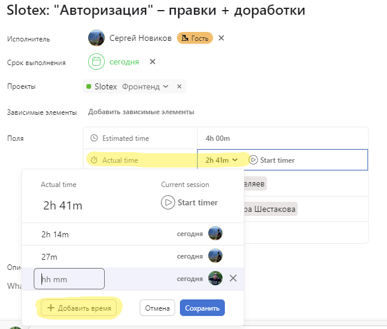
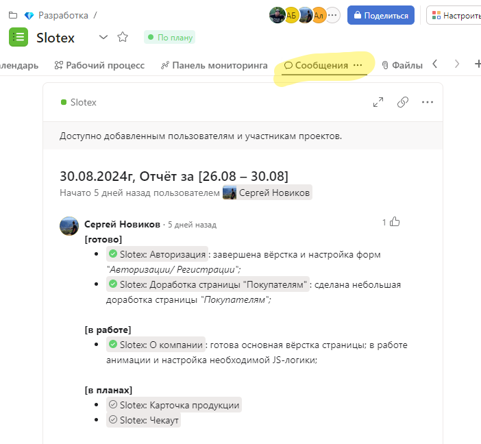

# Онбординг

- Получите личную почту `name@cedro.agency`

- Получите доступ в Bitrix24 и заполните свой профиль (аватарка, ДР, должность)

- Получите доступ к Asana

- Присоеденитесь к DISCORD серверу (если нет аккаунта, заведите)

- Финальный шаг - ознакомиться с данной документацией :)

## Собрания

- Ежедневные дейлики проходят в 10:35 по МСК

- Пятничный общий дейлик с камерами в 10:45 по МСК

## Задачи
- Как приступать к работе, описано в разделе [по флоу](37_flow.md)

- Трекаем затраченное время в Asana каждый день

- В пятницу пишем суммарный отчёт в проекте

